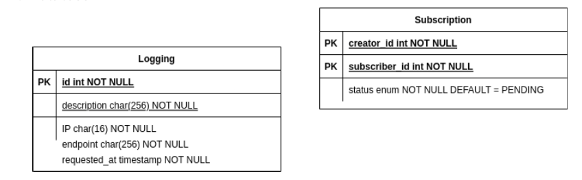

# binotify-rest: The (Infamous) Backend for binotify

## Introduction

binotify-soap adalah backend dari keseluruhan aplikasi binotify dengan protokol SOAP. Aplikasi ini dibuat dengan menggunakan Java dengan library Jakarta-WS. Aplikasi ini dibuat untuk memenuhi tugas besar mata kuliah Pemrograman Aplikasi Berbasis Web.

## Overview Feature

- SOAP Protocol in 2022
- Logging
- Dockerized
- Built with Maven

## Skema basis data

  
Basis data terdiri atas dua tabel, logging dan subscription. Tabel logging menyimpan informasi mengenai request yang dilakukan oleh user, sedangkan tabel subscription menyimpan informasi mengenai subscription yang dilakukan oleh user `binotify-app`.

## Daftar endpoint

Semua endpoint berada pada /ws/subscription

- newSubscription
  Untuk menambahkan subscription baru dari user `binotify-app`
- checkSubscription
  Untuk cek apakah user telah tersubscribe kepada artist tertentu
- updateSubscription
  Untuk mengubah status subscription dari user tertentu
- getAllSubscriptionRequest
  Untuk mendapatkan seluruh subscription request yang masih pending
- getAllSubscriptionRequestBySubscriber
  Untuk mendapatkan seluruh subscription request yang berdasarkan subscriber
- getAllSubscribedArtistsBySubscriber
  Untuk mendapatkan seluruh artist yang telah di subscribe oleh subscriber tertentu

Untuk melihat detail dari setiap endpoint, silahkan lihat file `Binotify.postman_collection.json` yang terdapat pada repositori `binotify-config`.

## Cara menjalankan aplikasi

Alternatif 1:

1. Pastikan sudah terinstall maven dan Java 11
2. Jalankan perintah `mvn clean install`
3. Jalankan perintah `mvn clean compile assembly:single`
4. Jalankan perintah `java -jar ./target/soap-1.0-SNAPSHOT-jar-with-dependencies.jar`

Alternatif 2:

1. Pastikan sudah terinstall docker
2. Lakukan docker compose dengan perintah `docker-compose up --build`

### Pembagian Tugas

#### Proudly Presented by Binosed, 2022
